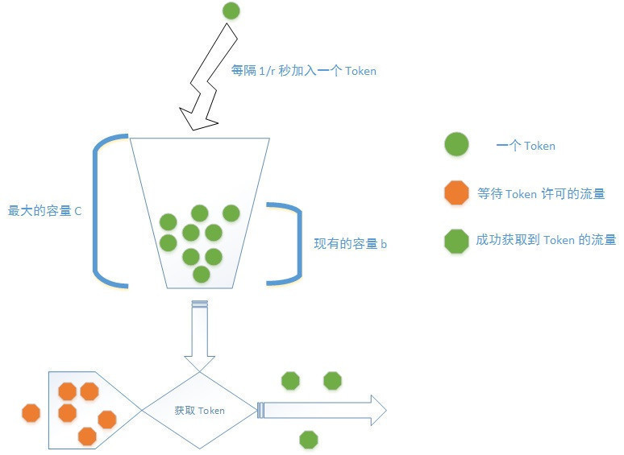

# 令牌桶限频（Rate Limiter）




高可用对于一个应用和API接口是至关重要的。如果我们提供一个接口，突然面临流量爆发式增长，对于这种情况，不仅会影响网站的访问速度，甚至可能会导致服务器崩溃，使得所有用户都无法正常访问。

对于这种情况，有的同学认为：“我们可以通过提高配置或者增加机器去解决这样的问题”。这在某些情况下，确实是一种选择。然而当我们使用一个接口或应用时，我们不仅需要通过技术手段（幂等性、熔断等）去提高它们的稳定性，同时也确保因为其他突发原因（如新同事编写的代码导致意外的发生等）带来的问题。

以下几种情况，频率限制可以帮助我们更好的确保API的可用性：

- 用户使用脚本，向我们发送了大量的请求。
- 用户向我们发送了许多低优先级接口数据的请求，而我们希望这些低优先级的请求尽量不影响我们高优先级接口请求（如电商，必须保证下单流程是正常的，其他的接口优先级自然低于下单流程相关的接口）。
- 因突然原因，无法同时正常访问所有接口，因此需要临时丢弃优先级低的请求（当然`Nginx`层面也是可以实现的）。


## 令牌桶介绍

令牌桶算法的原理是系统会以一个恒定的速度往桶（bucket）放入令牌（token），而如果请求需要被处理，则需要先从桶里获取一个令牌，当桶里没有令牌可取时，则拒绝服务（denial of service）。

**特点：**

1. 当`bucket`满的时候，将不再放入`token`，也就是`token`数量不会超过`bucket`最大容量。
2. 由于`token`在一段时间内是有限的，所以即使发生突然流量，也能很好的保护服务。


## 实现方式

对于令牌桶的实现，一般常用的有两种：

### 第一种

后台启动一个线程，按照一定的时间颗粒度，不断的往`固定大小`的桶（bucket）增加令牌（token），直到达到`桶`的最大容量。

这种做法不仅实现稍微繁琐一点，需要额外维护一个脚本；而且在没有请求的情况下，线程也会不断的去检查更新token，如果key比较多的情况下，对CPU会有较大的性能影响。

### 第二种（本文案例）

每次访问，将本次访问的时间和速率存入`redis`，并在下次新的请求访问时，对比`当前时间`和`上次请求时间`两个时间差之间的可使用token数量，并将新的结果存入`redis`。


## 代码实现

- `initNum` 桶初始大小
- `expire`单位时间
- `nowTime` 当前访问的时间
- `limitData['time']` 上次请求的时间

```php
<?php

namespace app\components;

use yii\base\Component;

class RateLimiter extends Component
{
    public $redis = null;

    public $cacheKey = null;

    // number of visits per minute by a single user
    // 单位时间下，单个用户访问的次数
    public $initNum = 30;

    // unit time
    // 单位时间
    public $expire = 60;

    /**
     * RateLimiter constructor.
     * @param string $initNum
     * @param string $expire
     */
    public function __construct($cacheKey = '', $initNum = '', $expire = '')
    {
        if (empty($cacheKey)) {
            return false;
        }

        $this->redis = \Yii::$app->redis;
        $this->initNum = $initNum ?? $this->initNum;
        $this->expire = $expire ?? $this->expire;
        $this->cacheKey = $cacheKey;
    }

    /**
     * handler
     * @return array
     */
    public function handler()
    {
        $ret = self::_limit($this->cacheKey, $this->initNum, $this->expire);
        if (empty($ret['status'])) {
            return false;
        }

        return true;
    }

    private function _limit($cacheKey = '', $initNum = '', $expire = '')
    {
        $nowTime = time();

        $this->redis->watch($cacheKey);
        $redisData = $this->redis->get($cacheKey);
        $limitData = $redisData ? json_decode($redisData, true) : ['num' => $initNum, 'time' => $nowTime];

        // （单位时间访问频率 / 单位时间）*（当前时间 - 上次访问时间） = 上次请求至今可增加的访问次数
        $addNum = ($initNum / $expire) * ($nowTime - $limitData['time']);
        $newNum = min($initNum, (($limitData['num'] - 1) + $addNum));
        if ($newNum <= 0) {
            return ['status' => false, 'msg' => '当前时刻令牌用完啦！'];
        }

        $limitData = json_encode(['num' => $newNum, 'time' => $nowTime]);
        $this->redis->multi();

        $this->redis->set($cacheKey, $limitData);

        if (!$this->redis->exec()) {
            return ['status' => false, 'msg' => '访问频次过多！'];
        }

        return ['status' => true, 'msg' => 'ok'];
    }
}
```


## 总结

令牌桶频率限制是`API`接口设计中重要的安全策略之一，但是对于不同的业务和场景都应该使用最适合的方法（如登录密码错误，一天只能尝试五次，这种情况计数器限频就是更好的选择了），万事并无绝对。


## 参考

1. https://medium.com/smyte/rate-limiter-df3408325846
2. https://stripe.com/en-hk/blog/rate-limiters


